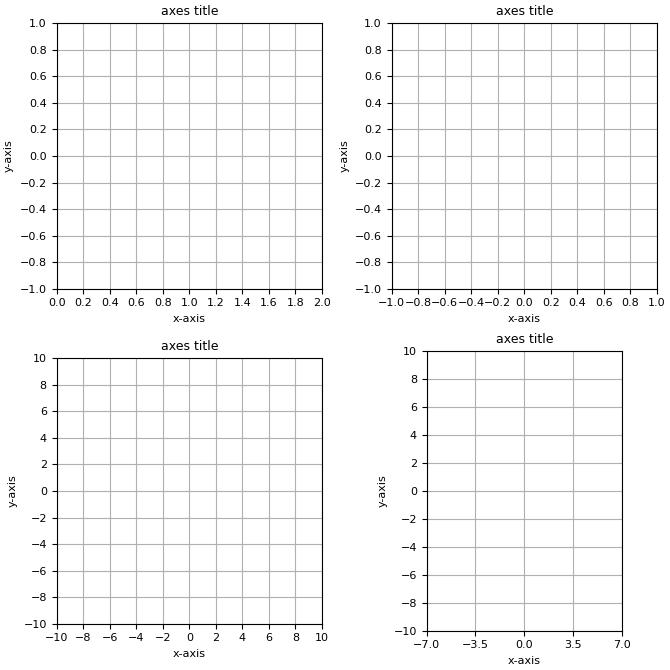

# pyConics

`pyConics` handles points, lines and conics by using algebraic geometry
 and homogeneous coordinates (projective geometry).

## Installation

From a local directory clones this project:

```bash
git clone https://github.com/osowsky/pyConics.git (by using http)
or
git clone git@github.com:osowsky/pyConics.git (by using ssh)
```

You can install this package, as well:

```bash
pip install pyConics
```

<span style="color:green">**NOTE:**<br></span>
*`pyConics` has been tested on Windows 10 and Elementary 6 OSes. If something is
going wrong with other OS, please reach me out so that I can fix your problem.* 

## Usage

`pyConics` can be used to handle points, lines and conics by using algebraic
geometry and homogeneous coordinates.

<span style="color:red">**WARNING:**<br></span>
*To avoid any conflict name, from the version 1.0.0 onwards, the `Point` and `Line`
classes had their names changed to `CPoint` and `CLine`, respectively.
For this reason, all of the examples in this file, `README.md`, had to be updated,
renaming these classes with their new names. I apologize for that.*

### Working with points *(v0.2.6 onwards)*

The representation in homogeneous coordinates of a Cartesian point
$p = (\enspace\alpha,\enspace\beta\enspace)$, where
$\alpha,\enspace\beta\enspace\in\enspace\mathcal{R}$,
is given by the following vector in $\mathcal{R}^3$:

$$
p=\left[\begin{array}{cc}
\enspace\alpha & \beta & 1.0\enspace
\end{array}\right]^{T}
$$

If you want to represent a point $p$ at infinity, you must define a
vector as follows:

$$
p=\left[\begin{array}{cc}
\enspace\alpha & \beta & 0.0\enspace
\end{array}\right]^{T},
$$

where $\enspace\alpha,\enspace\beta\enspace\in\enspace\mathcal{R}$

How to work with points in `pyConics`.

```python
    from pyConics import CPoint

    p1 = CPoint( ( 0.0, 1.0 ), 'p1' ) # p1 = ( 0.0, 1.0 ).
    p2 = CPoint( ( 1.0, 1.0 ), 'p2' ) # p2 = ( 1.0, 1.0 ).

    print( p1 ) # -> p1: [0.0000e+00 1.0000e+00 1.0000e+00].
    print( p2 ) # -> p2: [1.0000e+00 1.0000e+00 1.0000e+00].
    print()

    print( f'Are p1 and p2 the same? {p1 == p2}\n' ) # -> False.

    d12 = p1.distance( p2 )
    print( f'Distance from {p1}\nto {p2} is {d12:.4f}.\n' ) # -> d12 = 1.0.

    p3 = CPoint( ( 1, 1, 0 ), 'p3' ) # Point at the infinity.
    print( p3 ) # -> p3: [1.0000e+00 1.0000e+00 0.0000e+00] -> point at the infinity.
    print()

    print( f'Is p3 a point at infinity? {p3.at_infinity()}.\n' ) # -> True.

    d13 = p1.distance( p3 )
    print( f'Distance from {p1} to\n{p3} is {d13:.4f}.\n' ) # -> d13 = Inf.
```

### Working with lines *(v0.2.6 onwards)*

The representation in homogeneous coordinates of a Cartesian line
$l:\beta y=\alpha x + \gamma$, where
$\alpha,\enspace\beta,\enspace\gamma\in\enspace\mathcal{R}$,
is given by the following vector in $\mathcal{R}^3$:

$$
l=\left[\begin{array}{cc}
\enspace\alpha & -\beta & \gamma\enspace
\end{array}\right]^{T}
$$

The vector above satisfies the following homogeneous expression for straight lines
in projective geometry:

$$
l:\left\lbrace\enspace (\enspace x,\enspace y\enspace)\enspace|\enspace
\left[\begin{array}{cc}
\enspace\alpha & -\beta & \gamma\enspace
\end{array}\right]\times
\left[\begin{array}{c}
\enspace\ x \enspace\\
\enspace\ y \enspace\\
\enspace\ 1 \enspace\\
\end{array}\right]\enspace=\enspace 0
\enspace\right\rbrace
$$

If you want to represent a line $l$ at infinity, you must define a
vector as follows:

$$
l\enspace=\left[\begin{array}{cc}
\enspace 0.0 & 0.0 & \gamma\enspace
\end{array}\right]^{T},
$$

where $\enspace\gamma\enspace\in\enspace\mathcal{R}$

How to work with lines in `pyConics`.

```python
    from pyConics import CLine

    l1 = CLine( ( 1, -1, 1 ), 'l1' )         # l1: y = x + 1
    l2 = CLine( ( 1.5, -1.5, -1.5 ), 'l2' )  # l2: 1.5y = 1.5x - 1.5
    l3 = CLine( ( -1, -1, 1 ), 'l3' )        # l3: y = -x + 1
    l4 = CLine( ( 2, 2, -2 ), 'l4' )         # l4: 2y = -2x + 2

    print( l1 ) # -> l1: ( x, y ) | [1.0000e+00 -1.0000e+00 1.0000e+00] * [ x y 1 ]' = 0.
    print( l2 ) # -> l2: ( x, y ) | [1.5000e+00 -1.5000e+00 -1.5000e+00] * [ x y 1 ]' = 0.
    print( l3 ) # -> l3: ( x, y ) | [-1.0000e+00 -1.0000e+00 1.0000e+00] * [ x y 1 ]' = 0.
    print( l4 ) # -> l4: ( x, y ) | [2.0000e+00 2.0000e+00 -2.0000e+00] * [ x y 1 ]' = 0.
    print()

    # The relationships between two lines lx and ly can be:
    # 1) coincident lines: lx == ly or lx.are_coincident( ly ).
    #    Notice that l4 = -2 * l3. From the projective geometry both lines are
    #    coincident because they satisfy the same equation. 
    print( f'Is l1 == l1? {l1 == l1}.' )
    print( f'Is l3 == l4? {l3 == l4}.' )
    print( f'Is l1 == l2? {l1 == l2}.\n' )

    # 2) parallel lines: lx // ly or lx.are_parallel( ly ).
    #    Notice that coincident lines are parallel ones, as well.
    print( f'Is l1 // l2? {l1 // l2}.' )
    print( f'Is l2 // l3? {l2 // l3}.' )
    print( f'Is l3 // l4? {l3 // l4}.\n' )

    # 3) concurrent lines: lx.are_concurrent( ly )
    print( f'Are l1 and l2 concurrent lines? {l1.are_concurrent( l2 )}.' )
    print( f'Are l2 and l3 concurrent lines? {l2.are_concurrent( l3 )}.' )
    print( f'Are l3 and l4 concurrent lines? {l3.are_concurrent( l4 )}.\n' )

    # 4) perpendicular lines: lx + ly or lx.are_perpendicular( ly ).
    print( f'Is l1 + l3? {l1 + l3}.' )
    print( f'Is l2 + l4? {l2 + l4}.' )
    print( f'Is l3 + l4? {l3 + l4}.\n' )

    # Euclidean distance between lines.
    # Notice that, from the theory the distance between two concurrent
    # lines is equal to zero. 
    print( f'Distance from l1 to l2 is {l1.distance( l2 ):.4f}.' )
    print( f'Distance from l2 to l3 is {l2.distance( l3 ):.4f}.' )
    print( f'Distance from l3 to l4 is {l3.distance( l4 ):.4f}.\n' )

    # Lines at infinity.
    l5 = CLine( ( 0, 0, 2 ), 'l5' )
    l6 = CLine( ( 1, -1, 1 ), 'l6' )
    print( l5 )
    print( l6 )
    print( f'Is l5 a line at infinity? {l5.at_infinity()}.' )
    print( f'Is l6 a line at infinity? {l6.at_infinity()}.\n' )

    # Distance from l5 at infinity and l6.
    d56 = l5.distance( l6 )
    print( f'Distance from {l5} to {l6} is {d56}.\n' )
```

### Working with points and lines *(v0.2.6 onwards)*

Now that I have introduced you to the concepts of points and lines in projective
geometry and how you should work with them. The next step is to know how to use
both geometric shapes together.

However, before we start this step I must answer a question that you may be
wondering. If points and lines have the same vector representation, i.e., they
are both vectors in $\mathcal{R}^3$, how will I know if I am using a point
or a line?

A generic answer would be: The context will tell you whether the vectors in
$\mathcal{R}^3$ are points or lines.
For instance, the cross product operation can be used with the following
operands:

1. two points: The result is a straight line $l$ that passes through both points.
2. two lines: The result is the point of intersection $p$ between both lines.
3. a point $p$ and a line $l$: The result is a line that is perpendicular to
the straight line $l$ and passes through the point $p$.

Finally, the Table below shows six interesting interpretations about vector
representation of points and lines, four of which are not well-posed in
two-dimensional Euclidean Geometry, namely point and line at infinity.

$$
% \def\arraystretch{2.5}
\begin{array}{ccc}
\text{vector in }\mathcal{R}^3 & \text{point} & \text{line}\newline
\hline\hline
[\begin{array}{ccc}
\alpha & \beta & 0.0
\end{array}]^{T} & \text{point at infinity} & \text{line passing through the origin}\newline
\hline
[\begin{array}{ccc}
0.0 & 0.0 & \gamma
\end{array}]^{T} & \text{point at origin with }\gamma=1.0 & \text{line at infinity}\newline
\hline
[\begin{array}{ccc}
0.0 & 0.0 & 0.0
\end{array}]^{T} & \text{point at infinity} & \text{line at infinity}\newline
\hline
\end{array}
$$

How to work with points and lines in `pyConics`.

```python
    from pyConics import CPoint, CLine

    # Points.
    p1 = CPoint( ( 1, 3 ), 'p1' )   # p1 = ( 1, 3 )
    p2 = CPoint( ( 0, 4 ), 'p2' )   # p2 = ( 0, 4 )
    p3 = CPoint( ( -2, 0 ), 'p3' )  # p3 = ( -2, 0 )
    p4 = CPoint( ( 2, 0 ), 'p4' )   # p4 = ( 2, 0 )
    p5 = CPoint( ( 0, -4 ), 'p5' )  # p5 = ( 0, -4 )

    # Lines.
    l1 = CLine( ( 2, -1, 4 ), 'l1' )   #l1: y = 2x + 4
    l2 = CLine( ( 2, -1, -4 ), 'l2' )  #l2: y = 2x - 4
    l3 = CLine( ( 2, 1, 0 ), 'l3' )    #l3: y = -2x
    l4 = CLine( ( 1, 0, -2 ), 'l4' )   #l4: x = 2
    l5 = CLine( ( 0, 1, -4 ), 'l5' )   #l5: y = 4
    l6 = CLine( ( 3, -1, 0 ), 'l6' )   #l6: y = 3x

    # Test whether a point is in or is not in a Line.
    print( l1, p1, p2, p3, sep='\n' )
    print( f'Is p1 in l1? {p1 in l1}.' )    # p1 belongs to l1: False
    print( f'Is p2 in l1? {p2 in l1}.' )    # p2 belongs to l1: True
    print( f'Is p3 in l1? {p3 in l1}.\n' )  # p3 belongs to l1: True
    print( l6, p1, p4, sep='\n' )
    print( f'Is p1 in l6? {p1 in l6}.' )    # p1 belongs to l6: True
    print( f'Is p4 in l6? {p4 in l6}.\n' )  # p4 belongs to l6: False
    print( l4, p4, sep='\n' )
    print( f'Is p4 in l4? {p4 in l4}.\n' )  # p4 belongs to l4: True
    print( l5, p2, sep='\n' )
    print( f'Is p2 in l5? {p2 in l5}.\n' )  # p2 belongs to l5: True

    # Use the cross product to handle points and lines.
    # 1) the cross product between two points gives us a line that
    #    passes through these points.
    l: CLine = p2 * p3
    l.name = 'l'
    print( l1, l, sep='\n' )
    print( f'Are l and l1 coincident? {l==l1}.\n' )
    l: CLine = p4 * p5
    l.name = 'l'
    print( l2, l, sep='\n' )
    print( f'Are l and l2 coincident? {l==l2}.\n' )

    # 2) the cross product between two lines gives us their point
    #    of intersection.
    p: CPoint = l1 * l3
    p.name = 'p'
    print( l1, l3, p, sep='\n' )
    print( f'Is p in l1? {p in l1}.' )
    print( f'Is p in l3? {p in l3}.\n' )
    p: CPoint = l2 * l4
    p.name = 'p'
    print( l2, l4, p4, p, sep='\n' )
    print( f'Is p in l2? {p in l2}.' )
    print( f'Is p in l4? {p in l4}.' )
    print( f'Are p and p4 coincident? {p==p4}.\n' )

    # Two parallel lines have their point of intersection at infinity.
    # So, ...
    p: CPoint = l1 * l2
    p.name = 'p'
    print( l1, l2, p, sep='\n' )
    print( f'Is p in l1? {p in l1}.' )
    print( f'Is p in l2? {p in l2}.' )
    print( f'Is p in l4? {p in l4}.' )
    print( f'Is p at infinity? {p.at_infinity()}.\n' )

    # 3) the cross product between a point and a line gives us a
    #    line which is perpendicular to that line and passes
    #    through that point.
    l: CLine = l2 * p2
    l.name = 'l'
    print( p2, l2, l, sep='\n' )
    print( f'Is p2 in l? {p2 in l}.' )
    print( f'Are l2 and l perpendicular? {l2 + l}.\n' )
    p: CPoint = l2 * l
    p.name = 'p'
    print( l2, l, p, sep='\n' )
    print( f'Is p in l? {p in l}.' )
    print( f'Is p in l2? {p in l2}.' )

    # Getting the distance between p2 and l2.
    print( f'Distance from p2 to l2 = {p2.distance( l2 ):.4f}.' )
    print( f'Distance from p2 to p  = {p2.distance( p ):.4f}.\n' )
```

### Creating and setting up the CFigure and CAxes Classes *(v1.0.0 onwards)*

Two classes have been developed for this version, namely `CFigure` and `CAxes`,
so that it is now possible to graph points and lines from the `CPoint` and
`CLine` classes, respectively.
Both are derived from pyPlot classes. Therefore, they are very similar to
those existing in pyPlot. Actually, you can use the `get_pyplot_figure()` and
`get_pyplot_axes()` methods to obtain an instance of pyPlot's `Figure` and
`Axes` Classes, respectively, and work directly with them as if you were
using pyPlot.

In this section, code segments will be used for each sub-section, so if you
want to get the result shown in our image, the current code segment must be
inserted below the previous one.

Let's know how to set up these classes.

- Creating an empty figure and then its four axes.

```python
    from pyConics import CFigure, CAxes

    # Set interactive mode.
    # Activate this mode so that it is not necessary to call the show() method.
    # Whether you comment this line or use CFigure.ioff() method, the show()
    # method must be called.
    CFigure.ion()

    # Create an empty figure.
    # Its width and height are relative to the screen size.
    width = 0.35
    f1: CFigure = CFigure( (width, 16.0 / 9.0 * width ) )

    # If CFigure.ion() is on then you need to press a key to continue.
    if ( CFigure.is_interactive() ):
        input( 'Press any key to continue...' )

    # Create a 2x2 grid of axes from f1.
    f1.create_axes( ( 2, 2 ) )

    # Get the list of CAxes classes for the 2x2 grid.
    axes: list[ CAxes ] = f1.axes

    # If CFigure.ion() is on then you need to press a key to continue.
    if ( CFigure.is_interactive() ):
        input( 'Press any key to continue...' )
```

<p align="center">
    
</p>

- Changing the x- and y-axis limits and ticks of an axes.

```python
    # Changing the x- and y-axis limits and the
    # x- and y-ticks of axes[ 0 ].
    axes[ 0 ].xlim = ( 0, 2 )
    axes[ 0 ].ylim = ( -1, 1 )
    xtick = np.linspace( 0, 2, 11 )
    ytick = np.linspace( -1, 1, 11 )
    axes[ 0 ].xticks = xtick
    axes[ 0 ].yticks = ytick

    # Changing the x- and y-axis limits and the
    # x- and y-ticks of axes[ 1 ].
    axes[ 1 ].xlim = ( -1, 1 )
    axes[ 1 ].ylim = ( -1, 1 )
    xtick = np.linspace( -1, 1, 11 )
    ytick = np.linspace( -1, 1, 11 )
    axes[ 1 ].xticks = xtick
    axes[ 1 ].yticks = ytick

    # Changing the x- and y-axis limits and the
    # x- and y-ticks of axes[ 2 ].
    axes[ 2 ].xlim = ( -10, 10 )
    axes[ 2 ].ylim = ( -10, 10 )
    xtick = np.linspace( -10, 10, 11 )
    ytick = np.linspace( -10, 10, 11 )
    axes[ 2 ].xticks = xtick
    axes[ 2 ].yticks = ytick

    # Changing the x- and y-axis limits and the
    # x- and y-ticks of axes[ 3 ].
    # Note that the dimension of the plot box has
    # changed. This is because the aspect ration of
    # the CAxes class has equal scaling ( x/y-scaling = 1.0).
    # This makes circles circular, not elliptical.
    axes[ 3 ].xlim = ( -7, 7 )
    axes[ 3 ].ylim = ( -10, 10 )
    xtick = np.linspace( -7, 7, 5 )
    ytick = np.linspace( -10, 10, 11 )
    axes[ 3 ].xticks = xtick
    axes[ 3 ].yticks = ytick

    # If CFigure.ion() is on then you need to press a key to continue.
    if ( CFigure.is_interactive() ):
        input( 'Press any key to continue...' )
```

<p align="center">
    
</p>

- Changing title, x-label, and y-label of an axes.

```python
# Changing the title of axes[ 0 ].
    axes[ 0 ].title = 'The tittle is hello, world!'

    # If CFigure.ion() is on then you need to press a key to continue.
    if ( CFigure.is_interactive() ):
        input( 'Press any key to continue...' )

    # Changing the x- and y-label of axes[ 1 ].
    axes[ 1 ].xlabel = 'this is a physical quantity'
    axes[ 1 ].ylabel = 'this is another physical quantity'

    # If CFigure.ion() is on then you need to press a key to continue.
    if ( CFigure.is_interactive() ):
        input( 'Press any key to continue...' )

    # Using latex language in axes[ 2 ].
    axes[ 2 ].title = r'alpha is written as $\alpha$'
    axes[ 2 ].xlabel = r'beta is written as $\beta$'
    axes[ 2 ].ylabel = r'gamma is written as $\gamma$'

    # If CFigure.ion() is on then you need to press a key to continue.
    if ( CFigure.is_interactive() ):
        input( 'Press any key to continue...' )
```

<p align="center">
    
</p>

<span style="color:green">**NOTE:**<br></span>
The `CAxes` class in `pyConics` has setters for its title, xlabel, ylabel, xticks,
and yticks that do not allow you to change their font size directly, i.e., the
`pyConics` fixed the font size of these attributes by default, namely:
- title: fontsize = 9
- x- and y-labels: fontsize = 8
- x- and y-ticks: fontsize = 8

If, for any reason, you need to change one of these default font sizes, you must get
the `Axes` object that belongs to the `pyPlot` by mean of the `CAxes`'s `get_pyplot_axes()`
method and then call the method that does this task.

An example code to do this is shown below.

```python
    from pyConics import CFigure, CAxes

    # Set interactive mode.
    CFigure.ion()

    # Create an empty figure.
    # Its width and height are relative to the screen size.
    width = 0.35
    f1: CFigure = CFigure( (width, 16.0 / 9.0 * width ) )

    # Create a 1x1 grid of axes from f1.
    # The title font size is 9.
    f1.create_axes( ( 1, 1 ) )

    # If CFigure.ion() is on then you need to press a key to continue.
    if ( CFigure.is_interactive() ):
        input( 'Press any key to continue...' )

    # Get the list of CAxes classes for the 1x1 grid.
    ax: list[ CAxes ] = f1.axes

    # Get the pyPlot's axes.
    pp_ax = ax[ 0 ].get_pyplot_axes()

    # Changing the font size of the title in pyPlot's Axes.
    # Now, the title font size is 16.
    pp_ax.set_title( pp_ax.get_title(), fontsize = 16 ) 

    # If CFigure.ion() is on then you need to press a key to continue.
    if ( CFigure.is_interactive() ):
        input( 'Press any key to continue...' )
```

### Drawing points (`CPoint`) and lines (`CLine`) on CAxes Class *(v1.0.0 onwards)*

Once you have already learned how to create and set up the `CFigure` and
`CAxes` classes, you are able to learn how to use the `plot()` method in
`CAxes` class for drawing points and lines inside the `CPoint` and
`CLine` classes, respectively.

This `plot()` method has been derived from the `pyPlot`'s `plot()` method.
Therefore, everything you did with `pyPlot`'s `plot()`, you can continue
to do with `plot()` method that belongs to the `CAxes` class. 

In addition, `CAxes.plot()` method can receive either a point such as `CPoint`, a
straight line such as `Cline`, a list of points such as `list[CPoint]` or a
list of straight lines such as `list[CLine]` as argument to be plotted on
screen (into a `CAxes` class).

Now, let's start.

- Plotting a `CPoint` and a `numpy` point.

```python
    from pyConics import CFigure, CAxes
    from pyConics import CPoint
    import numpy as np 

    # Create an empty figure.
    # Its width and height are relative to the screen size.
    width = 0.35
    f: CFigure = CFigure( (width, 16.0 / 9.0 * width ) )

    # Create a 1x1 grid of axes from f.
    # The title font size is 9.
    f.create_axes( ( 1, 1 ) )

    # Get the list of CAxes classes for the 1x1 grid.
    ax: list[ CAxes ] = f.axes

    # Creating a point using numpy.
    p1 = np.array( [ 0.5, 0.6 ] )       # p1 =( 0.5, 0.6 ) 

    # Creating a point using CPoint.
    p2 = CPoint( ( 0.5, 0.4 ), 'p2' )   # p2 =( 0.5, 0.4 )

    # Plotting both points
    ax[ 0 ].plot( p1[ 0 ], p1[ 1 ], 'ob', p2, 'om' )

    # Show Figure on screen.
    CFigure.show()
```

<p align="center">
    
</p>

- Plotting a list of `CPoint` and a list of `numpy` points.

```python
    from pyConics import CFigure, CAxes
    from pyConics import CPoint
    import numpy as np 

    # Create an empty figure.
    # Its width and height are relative to the screen size.
    width = 0.35
    f: CFigure = CFigure( (width, 16.0 / 9.0 * width ) )

    # Create a 1x1 grid of axes from f.
    # The title font size is 9.
    f.create_axes( ( 1, 1 ) )

    # Get the list of CAxes classes for the 1x1 grid.
    ax: list[ CAxes ] = f.axes

    # Creating a list of points using numpy.
    p = np.array( [ [ 0.3, 0.1 ],       # p[ 0 ] = ( 0.3, 0.1 )
                    [ 0.3, 0.2 ],       # p[ 1 ] = ( 0.3, 0.2 )
                    [ 0.3, 0.3 ],       # p[ 2 ] = ( 0.3, 0.3 )
                    [ 0.3, 0.4 ],       # p[ 3 ] = ( 0.3, 0.4 )
                    [ 0.3, 0.5 ] ] )    # p[ 4 ] = ( 0.3, 0.5 )

    # Creating a list of points using CPoint.
    p1 = CPoint( ( 0.7, 0.5 ), 'p1' )   # p1 = ( 0.7, 0.5 )
    p2 = CPoint( ( 0.7, 0.6 ), 'p2' )   # p2 = ( 0.7, 0.6 )
    p3 = CPoint( ( 0.7, 0.7 ), 'p3' )   # p3 = ( 0.7, 0.7 )
    p4 = CPoint( ( 0.7, 0.8 ), 'p4' )   # p4 = ( 0.7, 0.8 )
    p5 = CPoint( ( 0.7, 0.9 ), 'p5' )   # p5 = ( 0.7, 0.9 )
    pl = [ p1, p2, p3, p4, p5 ]

    # Plotting both the list of points
    ax[ 0 ].plot( p[ :, 0 ], p[ :, 1 ], 'ob', pl, '^m', markersize = 8 )

    # Show Figure on screen.
    CFigure.show()
```

<p align="center">
    
</p>

- Plotting a `CLine` and a `numpy` line.

A `CLine` is drawn with a number of points determined by the *clinesamples*
parameter, with its default value being 11.

```python
    from pyConics import CFigure, CAxes
    from pyConics import CLine
    import numpy as np 

    # Create an empty figure.
    # Its width and height are relative to the screen size.
    width = 0.35
    f: CFigure = CFigure( (width, 16.0 / 9.0 * width ) )

    # Create a 1x1 grid of axes from f.
    # The title font size is 9.
    f.create_axes( ( 1, 1 ) )

    # Get the list of CAxes classes for the 1x1 grid.
    ax: list[ CAxes ] = f.axes

    # Creating a line using numpy.
    x_i, x_f = ax[ 0 ].xlim
    x = np.linspace( x_i, x_f, 11 )
    y = 1.05 * x                            #  y = 1.05x

    # Creating a line using CLine.
    l1 = CLine( ( 1.05, 1.0, -1.0 ), 'l1' ) # y = -1.05x + 1.0 

    # Plotting both lines ( clinesamples = 11 )
    ax[ 0 ].plot( x, y, 'ob-', l1, 'sm-', linewidth = 0.5, markersize = 6 )

    # Plotting a vertical line with clinesamples = 21
    l2 = CLine( ( 1.0, 0.0, -0.8 ), 'l2' )  # x = 0.8 for all y.
    ax[ 0 ].plot( l2, '^y-', clinesamples = 21, linewidth = 0.5, markersize = 6 )

    # Show Figure on screen.
    CFigure.show()
```
<p align="center">
    
</p>

- Plotting a list of `CLine`.

```python
    from pyConics import CFigure, CAxes
    from pyConics import CLine
    import numpy as np 

    # Create an empty figure.
    # Its width and height are relative to the screen size.
    width = 0.35
    f: CFigure = CFigure( (width, 16.0 / 9.0 * width ) )

    # Create a 1x1 grid of axes from f.
    # The title font size is 9.
    f.create_axes( ( 1, 1 ) )

    # Get the list of CAxes classes for the 1x1 grid.
    ax: list[ CAxes ] = f.axes

    # Create some lines and add them to a list.
    l1 = CLine(( 0.0, 1.0, -0.1 ), 'l1' )   # y = 0.1 for all x
    l2 = CLine(( 0.0, 1.0, -0.9 ), 'l2' )   # y = 0.9 for all x
    l3 = CLine(( 1.0, 0.0, -0.1 ), 'l3' )   # x = 0.1 for all y
    l4 = CLine(( 1.0, 0.0, -0.9 ), 'l4' )   # x = 0.9 for all y
    l = [ l1, l2, l3, l4 ]
    ax[ 0 ].plot( l, 'ob-', clinesamples = 11, linewidth = 0.5, markersize = 4 )

    # Create some others lines and add them to a list.
    l5 = CLine(( 1.0, 1.0, -1.0 ), 'l5' )   # y = -x + 1
    l6 = CLine(( 1.0, -1.0, 0.0 ), 'l6' )   # y = x
    l = [ l5, l6 ]
    ax[ 0 ].plot( l, 'or:', clinesamples = 21, linewidth = 1.0, markersize = 6 )

    # Show Figure on screen.
    CFigure.show()
```

<p align="center">
    
</p>


## Contributing

Interested in contributing? Check out the contributing guidelines.
Please note that this project is released with a Code of Conduct.
By contributing to this project, you agree to abide by its terms.

## License

`pyConics` was created by Jefferson Osowsky.
It is licensed under the terms of the GNU General Public License v3.0 license.

## Credits

`pyConics` was created with [`cookiecutter`](https://cookiecutter.readthedocs.io/en/latest/)
and the `py-pkgs-cookiecutter` [template](https://github.com/py-pkgs/py-pkgs-cookiecutter).

`pyConics` has used the following Python packages since its creation:

- [`numpy`](https://numpy.org/doc/stable/)
- [`matplotlib (pyPlot)`](https://matplotlib.org/stable/tutorials/pyplot.html)
- [`PyAutoGUI`](https://pyautogui.readthedocs.io/en/latest/#)
- `pytest`
